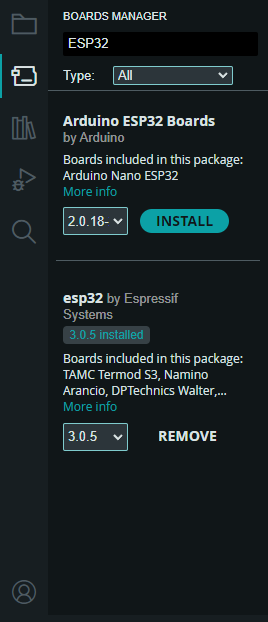
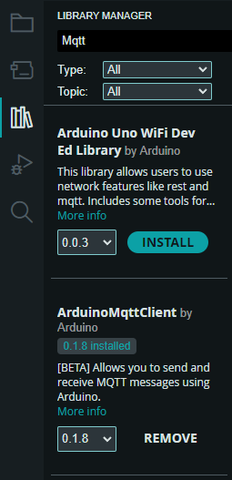
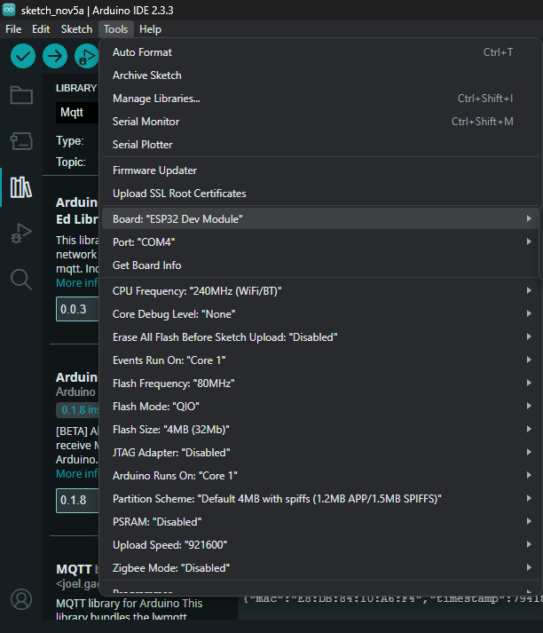
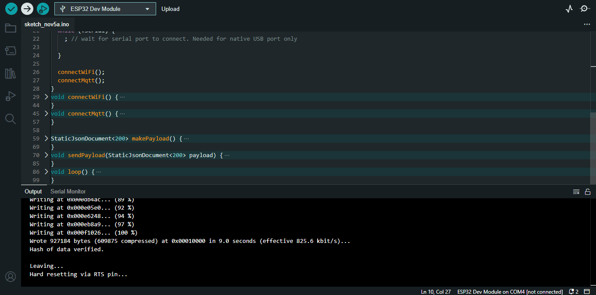

# Tupã Consumer
Serviço de recepção de dados para a aplicação Tupã.

- [Pré requisitos](#pré-requisitos)
- [Setup do ambiente de execução](#setup-do-ambiente-de-execução)
    - [Criando e ativando o ambiente virtual (Opcional)](#criando-e-ativando-o-ambiente-virtual-opcional)
    - [Instalando dependências](#instalando-dependências)
    - [Variáveis de Ambiente](#variáveis-de-ambiente)
- [Rodando o serviço](#rodando-o-serviço)
- [Formato do json recebido pelo MQTT](#formato-do-json-recebido-pelo-mqtt)
- [Script de teste de envio de dados ao serviço](#script-de-teste-de-envio-de-dados-ao-serviço)
- [Data Logger](#data-logger)
- [Setup do Data Logger](#setup-do-data-logger)
    - [Instalando dependências](#instalando-dependências-1)
    - [Selecionar o Board e a Porta](#selecionar-o-board-e-a-porta)
    - [Upload do código no processador](#upload-do-código-no-processador)

## Pré requisitos
- Python
- Redis
- PostgreSQL

## Setup do ambiente de execução

### Criando e ativando o ambiente virtual (Opcional)
```bash
python -m venv .venv & ./.venv/Scripts/activate
```

> [!WARNING]
> É possível que a política de execução de scripts do Windows impossibilite a criação do ambiente virtual, caso aconteça segue o artigo sobre políticas de execução: [https://learn.microsoft.com/pt-br/powershell/module/microsoft.powershell.core/about/about_execution_policies?view=powershell-7.4](https://learn.microsoft.com/pt-br/powershell/module/microsoft.powershell.core/about/about_execution_policies?view=powershell-7.4)

### Instalando dependências
```bash
pip install -r ./requirements.txt
```

### Variáveis de ambiente
Copie o arquivo .env_sample e adapte os valores das variáveis de ambiente para seu ambiente de execução.
```bash
cp ./.env_sample ./.env
```

## Rodando o serviço
```bash
python ./src/main.py
```

## Formato do json recebido pelo MQTT
```json
{
    "mac": "123",
    "dados": {
        "temp": 40,
        "umid": 3
    },
    "timestamp": 1729399539.969931
}
```
> [!NOTE]
> Vale ressaltar que as chaves dos dados variam de estação para estação, ou seja, nem sempre a temperatura vai ter uma chave chamada "temp", e haverá casos em que nem existirá temperatura.

## Script de teste de envio de dados ao serviço
Caso surgir a necessidade de um envio de dados manual de teste esse script fará o envio utilizando todo o setup do serviço.
```py
import paho.mqtt.publish as publish
from dotenv import load_dotenv
from os import getenv
from json import dumps
from datetime import datetime

load_dotenv()

TOPICO=getenv("TOPICO")
HOST=getenv("HOST_MQTT")
PORT=int(getenv("PORT_MQTT"))

mensagem = {
    "mac": "123",
    "data": {
        "temp": 40,
        "umid": 3
    },
    "timestamp": datetime.now().timestamp()
}

publish.single(
    topic=TOPICO,
    payload=dumps(mensagem),
    hostname=HOST,
    port=PORT
)

print(f"Mensagem publicada no tópico {TOPICO}: {mensagem}")
```

## Data Logger
O Data Logger faz parte da estação, ele é o microprocessador que recebe as informações dos sensores e transmite via protocolo MQTT para o serviço Tupã Consumer que irá tratar e armazenar esses dados.
Para o data logger foi utilizado o microprocessador ESP32.

## Setup do Data Logger

### Instalando dependências
É necessário instalar algumas dependências para a execução do código do microprocessador presente em [./esp](./esp/main.ino)

- ESP32 no Boards Manager
É necessário instalar os Boards do ESP32 feito por Espressif.



- ArduinoJson
É necessário instalar o ArduinoJson por Benoit Blanchon.


- ArduinoMqttClient
É necessário instalar o ArduinoMqttClient por Arduino.



### Selecionar o Board e a Porta
É necessário selecionar o Board: ESP32 Dev Module e a Porta que aparecer após a conexão do microprocessador na máquina, na aba ferramentas (tools).



### Upload do código no processador
Após realizar os processos acima, basta fazer upload do [código](./esp/main.ino) do microprocessador para o mesmo.
